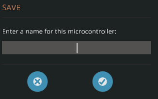

<!-- Controller name -->
<h1>Stormworks Lua Auto Counter</h1>

<!-- Translates -->

<!-- Table of contents -->
<h2>Table of contents</h2>
<ul>

<!-- Installation -->
<li>
    <a href="#installation">Installation</a>
    <ul>
        <li>
            <a href="#new-microcontroller">Create new microcontroller</a>
        </li>
        <li>
            <a href="#setup-properties">Setup properties</a>
        </li>
        <li>
            <a href="#setup-logic">Setup logic</a>
        </li>
        <li>
            <a href="#setup-symbol">Setup symbol</a>
        </li>
        <li>
            <a href="#setup-logic-properly">Setup logic properly</a>
        </li>
        <li>
            <a href="#save-controller">Save controller</a>
        </li>
    </ul>
</li>
</ul>
<!-- Installation -->
<h2><a id="installation">Installation</a></h2>
<ul>

<!-- Create new microcontroller -->
<li>
    <a id="new-microcontroller">Create new microcontroller</a>
     
    
</li>

<!-- Setup props -->
<li>
    <a id="setup-properties">Setup properties</a>
     
    
</li>

<!-- Setup logic -->
<li>
    <a id="setup-logic">Setup logic</a>
     
    
</li>

<!-- Setup symbol -->
<li>
    <a id="setup-symbol">Setup symbol</a>
     
    
</li>

<!-- Setup logic properly -->
<li>
    <a id="setup-logic-properly">Setup logic properly</a>
    <ul>
        <li>
            Go to edit logic
             
            
        </li>
        <li>
            Setup properly logic in controller
             
            
        </li>
        <li>
            Go to Lua Script and press "Edit Script"
             
            
        </li>
        <li>
            Paste all logic inside <a href="./controller.lua">controller.lua</a> file and press "Done"
        </li>
    </ul>
</li>

<!-- Save controller -->
<li>
    <a id="save-controller">Save controller</a>
    <ul>
        <li>
            Go to save button
             
            
        </li>
        <li>
            Press plus button
             
            
        </li>
        <li>
            Enter a name for this controller
             
            
        </li>
    </ul>
</li>
</ul>