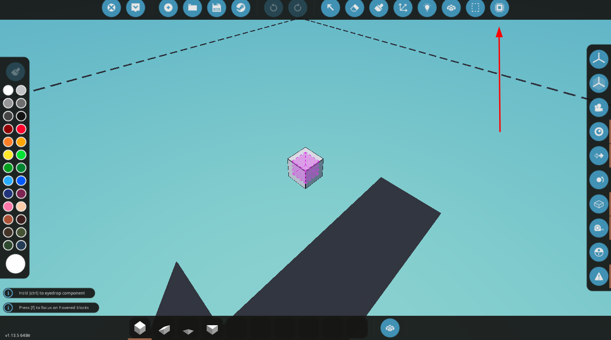

<!-- Controller name -->
<h1>Stormworks Lua RPS Тестер</h1>

<!-- Translates -->

<!-- Table of contents -->
<h2>Содержание</h2>
<ul>

<!-- Demonstration -->
<li>
    <a href="#demo">Демонстрация</a>
</li>

<!-- Installation -->
<li>
    <a href="#installation">Установка</a>
    <ul>
        <li>
            <a href="#new-microcontroller">Создайте новый контроллер</a>
        </li>
        <li>
            <a href="#setup-properties">Настройте параметры контроллера</a>
        </li>
        <li>
            <a href="#setup-logic">Настройте логику контроллера</a>
        </li>
        <li>
            <a href="#setup-symbol">Настройте символ контроллера</a>
        </li>
        <li>
            <a href="#setup-logic-properly">Настройте углубленную логику контроллера</a>
        </li>
        <li>
            <a href="#save-controller">Сохраните контроллер</a>
        </li>
    </ul>
</li>
</ul>

<!-- Demonstration -->
<h2><a id="demo">Демонстрация</a></h2>

<!-- Installation -->
<h2><a id="installation">Установка</a></h2>
<ul>

<!-- Create new microcontroller -->
<li>
    <a id="new-microcontroller">Создайте новый контроллер</a>
     
    
</li>

<!-- Setup props -->
<li>
    <a id="setup-properties">Настройте параметры контроллера</a>
     
    
</li>

<!-- Setup logic -->
<li>
    <a id="setup-logic">Настройте логику контроллера</a>
     
    <video src="ReadmeImgs/setup-logic.gif">
</li>

<!-- Setup symbol -->
<li>
    <a id="setup-symbol">Настройте символ контроллера</a>
     
    
</li>

<!-- Setup logic properly -->
<li>
    <a id="setup-logic-properly">Настройте углубленную логику контроллера</a>
    <ul>
        <li>
            Перейдите в редактирование логики
             
            
        </li>
        <li>
            Установите всю логику как на скриншоте ниже
             
            
        </li>
        <li>
            Перейдите в блок "Lua Script" и нажмите "Edit Script"
             
            
        </li>
        <li>
            Вставьте всю логику из <a href="./controller.lua">controller.lua</a> файла и нажмите "Done"
        </li>
    </ul>
</li>

<!-- Save controller -->
<li>
    <a id="save-controller">Сохраните контроллер</a>
    <ul>
        <li>
            Нажмите на кнопку сохранения
             
            
        </li>
        <li>
            Нажмите на кнопку с иконкой плюса
             
            
        </li>
        <li>
            Введите имя контроллера
             
            
        </li>
    </ul>
</li>

</ul>